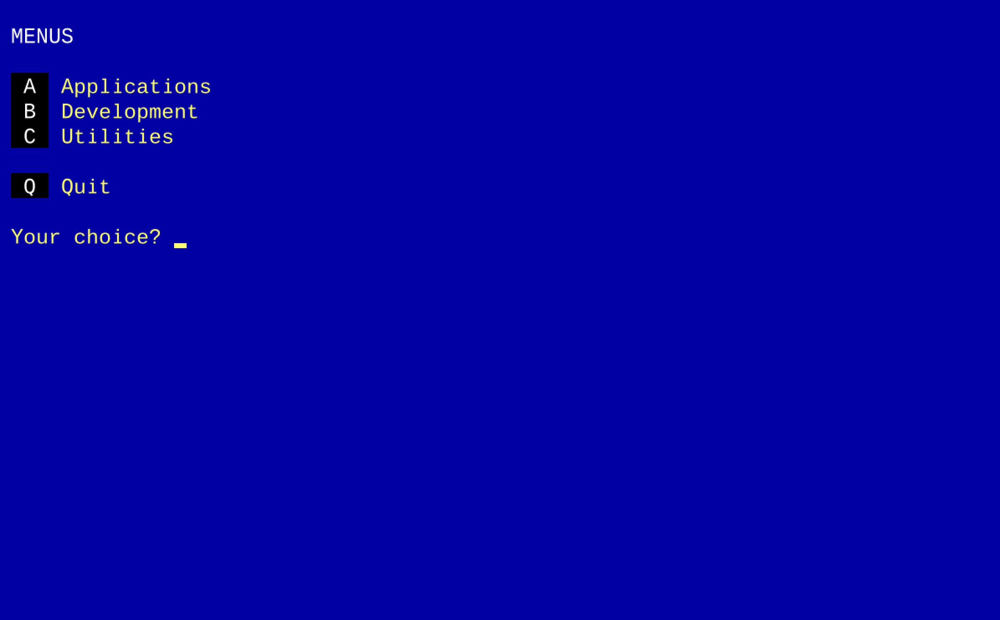
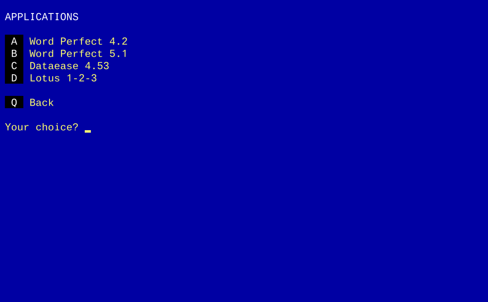

# MENU - An MSDOS menu system

A DOS text mode menu system allowing up to 12 menus of up to 12 options each.  Customisable colours.  Includes a standalone EXE built from Turbo Pascal 5 source.

- Copyright 2025 K Cartlidge
- Licensed under the [AGPL](./LICENSE.md)

The [`MENU.EXE`](./MENU.EXE) is standalone, pre-built under Turbo Pascal 5.
A [sample menu](./example.ini) is also available (see details further down).

## Contents

- [Screenshots](#screenshots)
- [Usage](#usage)
- [Example Menu File](#example-menu-file)
- [Important Notes](#important-notes)
- [Limitations](#limitations)

## Screenshots

- Top level showing all your loaded menus
  

- Second level menu showing all the options within one of your loaded menus
  

## Usage

The [`MENU.EXE`](./MENU.EXE) is standalone, pre-built under Turbo Pascal 5.

``` dos
menu <menu-file>
```

The menu file is in a `.ini` format, with contents as per the example below.

## Example Menu File

*A [sample menu](./example.ini) is also available.*

``` ini
# Example INI file for the menu program

# Optional global color settings.
# Understands the DOS color names (see below for a list).

TITLE = white on blue
TEXT  = yellow on blue
KEYS  = white on black

# Menus and options, in order of appearance.

[Applications]
Word Perfect 4.2  = C:\APPS\WP42\WP.EXE
Word Perfect 5.1  = C:\APPS\WP51\WP.EXE
Dataease 4.53     = C:\APPS\DE453\DEASE.EXE =50000
Lotus 1-2-3       = C:\APPS\123-24\123.EXE

[Development]
Turbo Pascal 5         = C:\DEV\TP5\TURBO.EXE
JPI TopSpeed Modula-2  = C:\DEV\JPI-M2\M2.EXE
MASM 5.0              = C:\DEV\MASM\MASM.EXE

[Utilities]
Norton Utilities  = C:\UTILS\NORTON\NU.EXE
PC Tools          = C:\UTILS\PCTOOLS\PCTOOLS.EXE
SideKick Plus     = C:\UTILS\SIDEKICK\SK.EXE
ProComm Plus      = C:\UTILS\PROCOMM\PROCOMM.EXE
```

- The colours are optional, and the available choices are listed below
- Lining up the `=` is not required, but helps visually
- Menus are displayed in the order they appear
- Menu items within menus are also displayed in the order they appear

*Colour Choices*

| Darker    | Lighter      |
|:--------- |:------------ |
| BLACK     | DARKGRAY     |
| BLUE      | LIGHTBLUE    |
| GREEN     | LIGHTGREEN   |
| CYAN      | LIGHTCYAN    |
| RED       | LIGHTRED     |
| MAGENTA   | LIGHTMAGENTA |
| BROWN     | YELLOW       |
| LIGHTGRAY | WHITE        |

## Important Notes

All files in DOS should be saved with CRLF line endings, including your menu file.

When running in the Turbo Pascal 5 IDE the menu system will work but you won't be able to launch a menu option.  This is a limitation of the IDE/DOS; run outside the IDE for launching menu options to work.

If you are building the source yourself in Turbo Pascal 5, change the *Options*, *Compiler*, *Memory Sizes* to reduce the *High* heap size to 65,536 or less (I build with 32,000).  If you don't, then launching a menu option command will fail as DOS will report insufficient memory.  When that happens it will show you the current memory usage.  Note that this is memory held by the menu system *not* memory available to the called application.  Lower is better; we only need enough for the working set of variables and menus.

## Limitations

Due to screen real-estate concerns, the following limits apply:

- No more than 12 menus
- No more than 12 items per menu
- Only one level of menus supported
  - At 12 * 12 that's still 144 options
